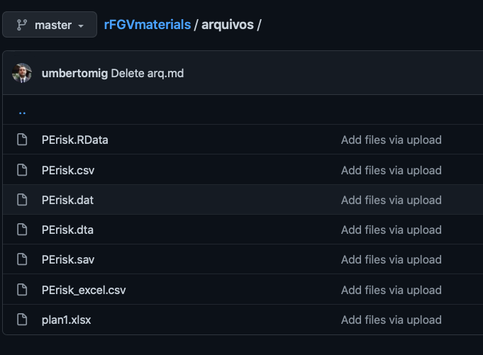
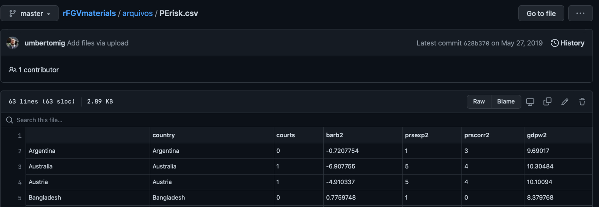
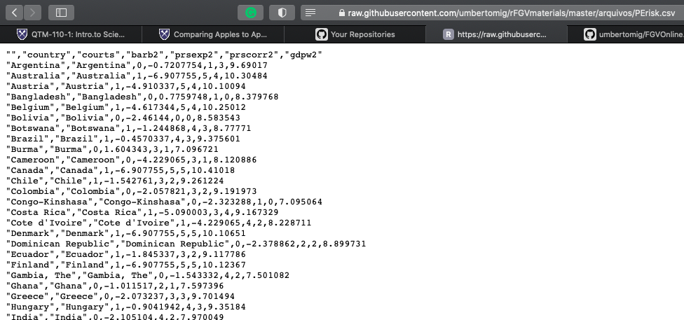

# Lendo Arquivos no R

Um problema comum é como carregar arquivos do `GitHub` ou outras aplicações na internet no R. Neste tutorial ensino como carregar arquivos em .csv que estão no GitHub na memória do R.

## Encontrando o Arquivo

Como exemplo, vou usar o [seguinte endereço de GitHub](https://github.com/umbertomig/rFGVmaterials/tree/master/arquivos).

Ao clicar no link, você encontrará os seguintes arquivos:



Suponha que você queira carregar o arquivo `PErisk.csv`. Clicando no arquivo, você será direcionado para uma aplicação para visualizar o arquivo:



Essa aplicação não vai te ajudar a ler o arquivo remotamente. No entanto, note que na tela tem no canto direito superior um botão chamado `Raw`. Nesse botão, você poderá abrir uma versão do arquivo em formato `.csv`:



No seu Browser, copie o link do arquivo. No meu software, o link é o seguinte: `https://raw.githubusercontent.com/umbertomig/rFGVmaterials/master/arquivos/PErisk.csv`. Copie esse link!

## No R

Na linha de comando do R, digite o nome do objeto em que deseja colocar o arquivo, por exemplo `PErisk`, e leia usando o comando `read.csv`. O comando todo ficaria:

```
PErisk <- read.csv('https://raw.githubusercontent.com/umbertomig/rFGVmaterials/master/arquivos/PErisk.csv')
```

Como a primeira coluna tem o nome de cada caso, um comando específico para esse banco de dados é adicionar `row.names = 1` ao comando anterior:

```
PErisk <- read.csv('https://raw.githubusercontent.com/umbertomig/rFGVmaterials/master/arquivos/PErisk.csv', row.names = 1)
```

Ambos os comandos deverão surtir o mesmo efeito. Se você prefere usar o pacote `tidyverse`, então substitua o comando `read.csv` pelo comand `read_csv`:

```
PErisk <- read_csv('https://raw.githubusercontent.com/umbertomig/rFGVmaterials/master/arquivos/PErisk.csv')
```

E a coluna 1 seria o nome dos casos, mas o `read_csv` lê errado. Para consertar, você pode remover essa coluna:

```
PErisk <- PErisk[,-1]
```

Com `read.csv` você cria um objeto chamado `data.frame`. Com `read_csv`, você cria um objeto chamado `tibble`. Eles são equivalentes, mas se você quiser transformar um `tibble` em um `data.frame`, você pode digitar:

```
PErisk <- as.data.frame(PErisk)
```

Vice-versa, para transformar um `data.frame` em um `tibble`, você deve digitar:

```
PErisk <- as_tibble(PErisk)
```

Bom divertimento!
